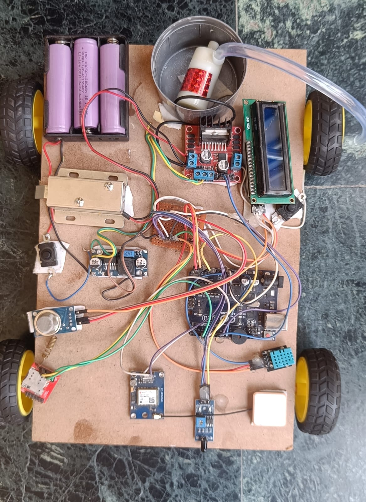

# Fire Prevention and Safety System for CNG Based Vehicles

## Overview
The Fire Prevention and Safety System for CNG Based Vehicles is an Arduino-based smart safety project designed to detect fire hazards and gas leakage in vehicles. The system provides real-time monitoring and automatically activates emergency safety mechanisms to reduce fire-related risks.

The project integrates multiple sensors and communication modules to ensure early hazard detection, emergency alerts, and automatic response.

---

## Features
- Gas Leakage Detection
- Flame Detection
- Smoke Monitoring
- Temperature Monitoring
- Automatic Water Pump Activation
- Buzzer Alert System
- GSM Emergency SMS Alert
- GPS Live Location Tracking
- LCD Display Monitoring
- IoT-Based Safety Monitoring
- Backup Safety Response Mechanism
- Solenoid Lock-Based Emergency Door Unlock System

---

## Technologies Used
- Arduino UNO
- Embedded C / C++
- IoT Sensors
- GSM Module
- GPS Module

---

## Components Used
- Arduino UNO
- MQ Gas Sensor
- Flame Sensor
- Smoke Sensor
- Temperature Sensor
- GSM Module (SIM800L)
- GPS Module (Neo-6M)
- Relay Module
- Mini Water Pump
- Solenoid Lock
- Buzzer
- 16x2 LCD Display
- Jumper Wires
- Breadboard
- Battery Pack / Power Supply
- DC Motors with Wheels
- Motor Driver Module
- Bluetooth Module
- LED Indicators

---

## Circuit Connections

| Component | Arduino Pin |
|---|---|
| MQ Gas Sensor | A0 |
| Smoke Sensor | A1 |
| Flame Sensor | D2 |
| Buzzer | D3 |
| Relay Module | D4 |
| Solenoid Lock Relay | D5 |
| GSM Module | D7, D8 |
| GPS Module | D9, D10 |
| LCD Display | I2C Interface |

---

## Working Principle
1. Sensors continuously monitor gas leakage, smoke, flame, and temperature conditions.

2. Arduino processes sensor data in real time.

3. If abnormal conditions are detected:
   - Buzzer alert turns ON
   - Water pump activates automatically
   - GSM module sends emergency SMS alerts
   - GPS module shares live location
   - LCD displays warning message
   - Solenoid lock automatically unlocks vehicle door

4. The system helps prevent fire accidents and improves passenger safety.

---

## Applications
- CNG Vehicles
- Smart Vehicle Safety Systems
- Fire Prevention Automation
- IoT-Based Monitoring Systems
- Industrial Safety Applications

---

## Installation & Setup

### 1. Clone the Repository

```bash
git clone https://github.com/NishantModanwal9696/Fire-Prevention-and-Safety-System-for-CNG-Based-Vehicles.git
```

### 2. Open the Arduino Code
- Arduino IDE
- VS Code with Arduino Extension

### 3. Install Required Libraries
- TinyGPS++
- LiquidCrystal_I2C
- DHT Sensor Library
- SoftwareSerial

### 4. Connect Hardware Components
- Connect all components according to the circuit diagram.

### 5. Upload the Code
- Upload the code to Arduino UNO.

---

## Software Requirements
- Arduino IDE
- TinyGPS++ Library
- LiquidCrystal_I2C Library
- DHT Sensor Library
- SoftwareSerial Library

---

## Power Supply Requirements

| Module | Voltage |
|---|---|
| Arduino UNO | 5V |
| GSM SIM800L | 3.7V – 4.2V |
| GPS Neo-6M | 3.3V – 5V |
| Solenoid Lock | 12V |
| Water Pump | 6V – 12V |

⚠ External power supply is recommended for GSM module, Solenoid Lock, and Water Pump.

---

## Project Structure

```bash
├── Arduino_Code
├── Images
├── Patent
├── Research_Paper
├── Report
└── README.md
```

---

## Project Image

<p align="center">
  
</p>

---

## Results
- Real-time gas leakage detection achieved
- Automatic fire suppression response activated
- GSM emergency alerts successfully delivered
- GPS live location tracking tested successfully
- LCD monitoring working correctly
- Solenoid lock emergency unlocking tested successfully

---

## Solenoid Lock Safety Mechanism

The project includes an automatic emergency door unlocking mechanism using a Solenoid Lock.

### Functionality
- Vehicle doors automatically unlock during emergency conditions
- Helps passengers exit safely
- Reduces panic during emergency situations
- Improves passenger safety during critical conditions

---

## Patent
Patent Application Published (A1) – Indian Patent Office

### Patent Details
- Title: Fire Prevention and Safety System for CNG Based Vehicles
- Publication No: IN202511125067 A1
- Publication Date: 30-01-2026

Patent document available in the [Patent](Patent/Patent_Publication.pdf) folder.

---

## Research Paper
Research paper related to this project is available in the [Research_Paper](Research_Paper/Research_Paper.pdf) folder.

---

## Project Report
Detailed project report is available in the [Report](Report/Project_Report.pdf) folder.

---

## Team Contribution

This project was developed as a team project.

### My Contribution
- Arduino Programming
- Sensor Integration
- Hardware Setup
- Testing and Debugging
- Module Integration
- Solenoid Lock Integration

---

## Future Improvements
- Mobile App Integration
- Cloud-Based Monitoring
- AI-Based Fire Prediction
- Real-Time Vehicle Analytics
- Automatic Engine Cutoff System

---

## Challenges Faced
- GSM signal instability
- Sensor calibration issues
- Power management problems
- Real-time module synchronization

---

## Safety Note
⚠ This project is a prototype model developed for educational and research purposes. Proper industrial-grade safety mechanisms are required before real-world vehicle deployment.


---

## Author
**Nishant Modanwal**
